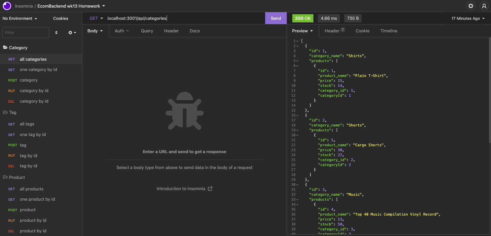

# ecomBackend
[](./LICENSE.md)    [](https://github.com/kbario)

## Description
ecomBackend is the workings for an ecommerce website that creates products in categories and assigns them tags so they can be searched and organised properly.

There is no implementation using the backend, but it is fully functional and a walk through video can be found below.

ecomBackend was created using JavaScript, Node.js, Sequelize, MySQL2 and dotenv.

## Table of Contents
  - [Installation](#installation)
  - [Usage](#usage)
    - [Using ecomBackend](#using-ecombackend)
  - [Contribute to ecomBackend](#contribute-to-ecombackend)
  - [Tests](#tests)
  - [Questions](#questions)
  - [Credits](#credits)
    - [Tutorials](#tutorials)
    - [Third-Party Assets](#third-party-assets)
  - [License](#license)


## Installation
Essentially clone the repo on your local machine. Navigate to the directory you want to save the repo and run:

    git clone https://github.com/kbario/ecomBackend.git

## Usage

### Using ecomBackend

ecomBackend is just the server-side workings of a ecommerce site and so only handles requests and send responses.

To utilise the functionality, install mysql on your local, run
```
mysql -u root -p

source schema.sql
```
which will create the database in your mysql server.

Add your details to the .env file and run node seeds/seed.js in the terminal which will seed the database you just created with data.

Finally, run 
```
node index.js
``` 
to start your server on your local and use Insomnia, Postman, or any other route testing application to utilse the endpoints of ecomBackend seen below.




## Contribute to ecomBackend

All contributions to ecomBackend are greatly appreciated and contributing is one of the many amazing things about open-source software.

To contribute to ecomBackend, all we ask is that you're empathic and supportive towards other developers and follow the standard contribution guidelines. Click the banner below for more information.
        
[](./CODE_OF_CONDUCT.md)


## Tests
    

## Questions
If you have any questions, feel free to contact me through my [GitHub](https://github.com/kbario/) or [Email me](mailto:kylebario1@gmail.com).

## Credits
Below are lists of links to tutorials and third-party assets that were used to create this project.

### Tutorials
- https://sequelize.org/master/index.html
### Third-Party Assets
- https://www.npmjs.com/package/dotenv
- https://www.npmjs.com/package/mysql2
- https://expressjs.com/
- https://sequelize.org/master/index.html

## License
Licensed under the [MIT](./LICENSE.txt) license.

---
This README was created with [Gener8aREADME](https://github.com/kbario/Gener8aREADME).
